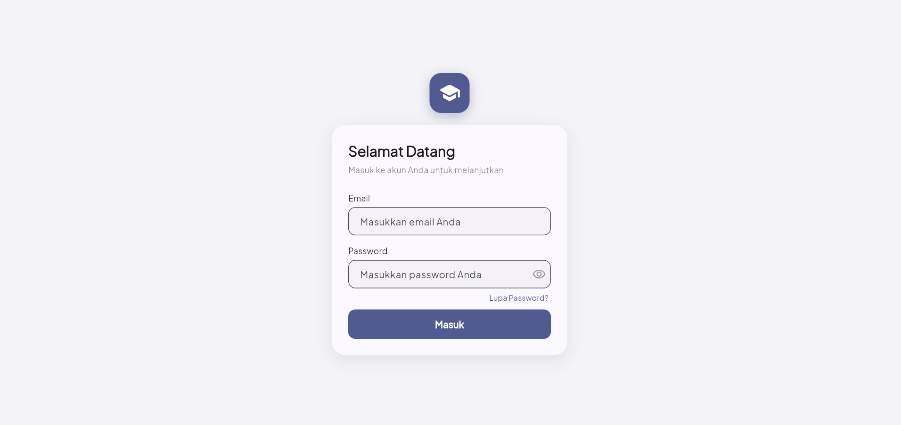
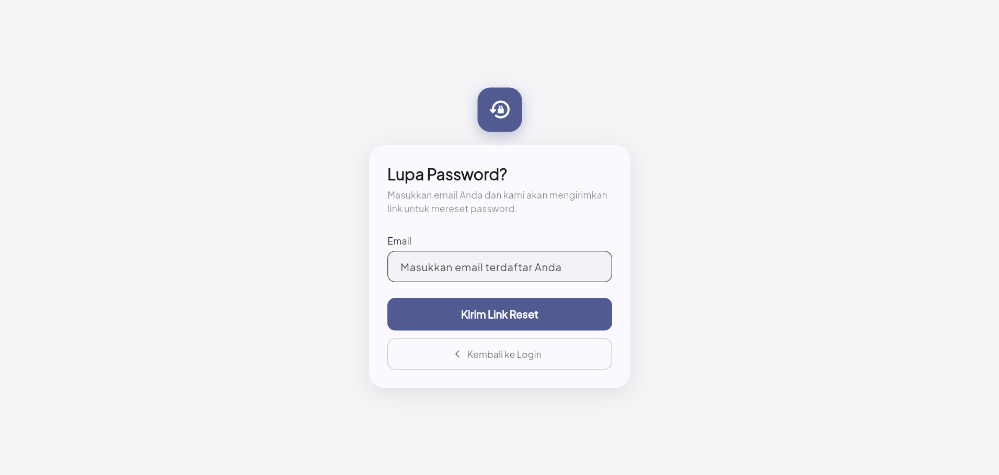
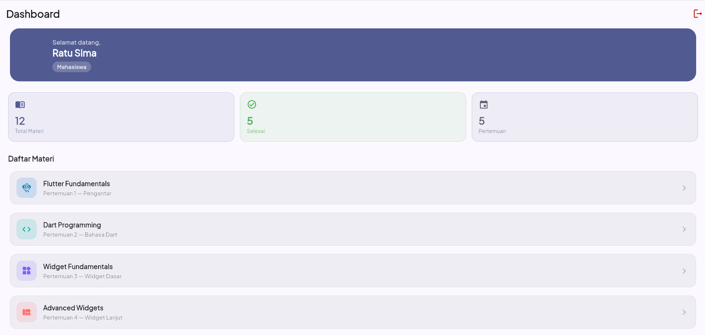

# Flutter UTS App — Mobile Programming

Aplikasi Flutter 3 halaman untuk UTS Mobile Programming. Mengimplementasikan materi Pertemuan 1–5.

---

## Deskripsi Aplikasi

Aplikasi simulasi sistem autentikasi sederhana yang terdiri dari:
- **Login Screen** — form login dengan validasi & state management
- **Lupa Password Screen** — form reset password dengan feedback visual
- **Dashboard Screen** — halaman utama dengan data user & daftar materi

---

## Daftar Fitur

### Halaman 1 — Login Screen
- [x] Form login dengan field Email dan Password
- [x] Validasi email (format regex) dan password (min 8 karakter, huruf + angka)
- [x] State management: `isLoading`, `errorMessage`, `isPasswordVisible`
- [x] Loading indicator saat login diproses
- [x] Toggle show/hide password
- [x] Snackbar/pesan error saat login gagal
- [x] Navigasi ke Forgot Password dengan `Navigator.pushNamed`
- [x] Navigasi ke Dashboard setelah login sukses dengan `Navigator.pushReplacementNamed`

### Halaman 2 — Lupa Password Screen
- [x] Form input email dengan validasi format
- [x] Tombol "Kirim Link Reset" dengan loading state
- [x] Feedback visual via Snackbar setelah berhasil
- [x] Tombol "Kembali ke Login" dengan `Navigator.pop`
- [x] Layout: Column, Padding, SizedBox, SafeArea

### Halaman 3 — Dashboard Screen
- [x] AppBar dengan judul dan tombol logout (Icons.logout)
- [x] Tampilan data user yang login dari AppState (InheritedWidget)
- [x] `SliverList` (ekuivalen ListView.builder) dengan 12 item dummy
- [x] Card dengan shadow, rounded corner, padding
- [x] Logout dengan `Navigator.pushAndRemoveUntil`
- [x] Dialog konfirmasi sebelum logout

---

## Cara Menjalankan Aplikasi

```bash
# 1. Clone repository
git clone <URL_REPO>
cd flutter_uts

# 2. Install dependencies
flutter pub get

# 3. Jalankan aplikasi
flutter run

# Atau jalankan di device tertentu
flutter devices        # lihat daftar device
flutter run -d <id>    # jalankan di device tertentu
```

**Akun Demo:**
| Email | Password | Role |
|-------|----------|------|
| admin@test.com | Admin123 | Administrator |
| ratu@test.com | ratu1234 | Mahasiswa |

---

## Struktur Folder

```
lib/
├── main.dart                    # Entry point & konfigurasi MaterialApp
├── models/
│   └── user_model.dart          # Model data user
├── screens/
│   ├── login_screen.dart        # Halaman 1: Login
│   ├── forgot_password_screen.dart  # Halaman 2: Lupa Password
│   └── dashboard_screen.dart   # Halaman 3: Dashboard
├── utils/
│   ├── app_state.dart           # State management (InheritedWidget)
│   └── validators.dart          # Fungsi-fungsi validasi
└── widgets/
    └── custom_widgets.dart      # Reusable widgets
```

---

## Daftar Package yang Digunakan

| Package | Versi | Alasan Penggunaan |
|---------|-------|-------------------|
| `google_fonts` | ^6.1.0 | Font Plus Jakarta Sans untuk tampilan lebih rapi dan modern |

---

## Konsep Flutter yang Diimplementasikan

| Konsep | Lokasi |
|--------|--------|
| StatefulWidget + setState | `login_screen.dart`, `forgot_password_screen.dart` |
| StatelessWidget | `dashboard_screen.dart`, semua custom widgets |
| InheritedWidget (State Management) | `utils/app_state.dart` |
| Form + GlobalKey + Validator | `login_screen.dart`, `forgot_password_screen.dart` |
| Navigator.push | Login → Forgot Password |
| Navigator.pop | Forgot Password → Login |
| Navigator.pushReplacementNamed | Login → Dashboard |
| Navigator.pushAndRemoveUntil | Dashboard → Login (logout) |
| Named Routes | `main.dart` |
| ListView (SliverList) | `dashboard_screen.dart` |
| Card widget | `dashboard_screen.dart` |
| dispose() lifecycle | Semua StatefulWidget |

---

## Screenshot

### Login Screen


### Forgot Password Screen


### Dashboard Screen


---

## Commit History Guidelines

```
git commit -m "feat: setup project structure and pubspec"
git commit -m "feat: add UserModel and AppState (InheritedWidget)"
git commit -m "feat: implement login screen with form validation"
git commit -m "feat: add forgot password screen with SnackBar feedback"
git commit -m "feat: implement dashboard with ListView and logout flow"
```
